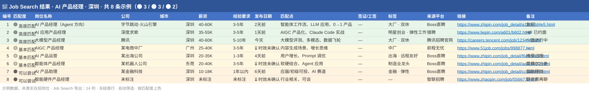

<p align="center">
  
</p>

<h1 align="center">🎯 Job Search · AI 岗位猎手</h1>

<p align="center">
  <b>把翻招聘网站的时间，换成一份值得投递的岗位清单。</b><br/>
  给你的 AI Agent 装上「求职猎头」技能 —— 基于简历在海量招聘信息里精准筛选、分级、质检，<br/>
  一轮产出 <b>50–100 个匹配岗位</b>，标注匹配点，还能一键导出 Excel 投递表。
</p>

<p align="center">
  
  
  
  
  
</p>

---

## ✨ 它能做什么

| | 能力 |
|---|---|
| 🎯 | **智能定向**：只问简历里没有的信息（地区 / 城市 / 薪资 / 硬性要求），已有信息直接复用 |
| 💥 | **关键词爆炸**：一个方向语义展开成 15+ 组关键词，中英文、上下游、技能反搜全覆盖 |
| 🧲 | **多平台并行**：LinkedIn / Indeed / Glassdoor + 各地区本土平台同步开搜 |
| 🔥 | **登录态高质抓取**：支持浏览器 MCP 接管 Boss 直聘分组，直接提 300–500 个在线岗位 |
| 🔍 | **独立质检**：启动子 Agent 复核匹配度、时效、去重，过滤已下架岗位后再交付 |
| 📊 | **分级输出**：🟢 高度匹配 → 🟡 基本匹配 → 🟠 可以尝试，每条附匹配点 |
| 📗 | **Excel 导出**：14 列表格、按匹配度上色、支持追加去重，投递清单直接上手 |

## 🗺️ 工作流一览

```
📄 简历画像 ──▶ 🎛️ 搜索条件 ──▶ 💥 关键词爆炸(10–20 组)
                                       │
                          ┌────────────┴────────────┐
                          ▼                         ▼
              🌐 WebSearch 免登录                🔐 登录态平台
              (含 30 天时效过滤)            (Chrome MCP / cookies)
                          └────────────┬────────────┘
                                       ▼
                          🧪 质检复核（独立 subagent）
                          · 🟢 全量验证 · 🟡 抽查 · 去重 · 时效
                                       ▼
                          🎁 分级输出 50–100 个岗位
                                       ▼
                          📗 Excel 导出 / 🔗 衔接其它 skill
```

## 📁 仓库结构

```
JobSearch/
├── README.md
├── assets/
│   └── job-search-excel-preview.svg     # 🎬 导出 Excel 的效果示意图
├── examples/
│   └── sample-job-search-result.xlsx    # 📗 可直接打开的示例结果表
└── skills/
    └── job-search/                  # 核心技能（复制到你的 skills 目录即可）
        ├── SKILL.md                 # 主逻辑：信息收集 · 搜索执行 · 质检 · 输出
        └── references/
            ├── platforms-cn.md      # 🇨🇳 中国区平台清单 + 搜索语法 + 下架标志语
            ├── platforms-global.md  # 🌏 海外分地区平台 + 工签筛选语法 + 下架标志语
            ├── login-platforms.md   # 🔐 Boss 直聘等登录态抓取三种方式教程
            └── excel-export.md      # 📗 Excel 14 列规范 + 追加去重逻辑
```

## 🚀 安装

**Claude Code**

```bash
# 克隆仓库
git clone https://github.com/Sean-9/JobSearch.git

# 把技能复制到你的 skills 目录（Windows / macOS / Linux 同理）
cp -r JobSearch/skills/job-search ~/.claude/skills/
```

重启会话后即可使用。其它支持 Agent Skills 的 AI（Codex、Cursor 等）复制到对应 skills 目录即可，skill 内部已按环境能力自动降级适配。

### ⚡ 一键安装：不用敲命令，直接对你的 AI 说（复制即用）

> **WorkBuddy / Claude Code / Codex / 豆包** 等都能用 👇

```text
帮我安装 Job Search 这个求职技能：https://github.com/Sean-9/JobSearch
装好后参考我桌面上的简历（简历.pdf），在【深圳】找一批【AI 产品经理】的岗位，
期望 30-50K，最好双休。
```

装好后 AI 会先跟你确认岗位方向 / Base 城市 / 期望薪资 / 硬性要求，再开搜、质检、按匹配度列出岗位，最后询问是否导出 Excel（见下方「使用效果」）。

- **WorkBuddy / 豆包 / 通用助手**：把上面这句直接粘进对话即可，它们会自动 clone 仓库、把 `skills/job-search` 装进技能库再开始搜；
- **Claude Code / Codex / Cursor**：直接粘贴即可；如果它没自动装，改让它执行下面两条命令：

```bash
git clone https://github.com/Sean-9/JobSearch
cp -r JobSearch/skills/job-search ~/.claude/skills/   # 其它客户端换成各自的 skills 目录路径
```

## 🧭 怎么触发

**斜杠命令**
```
/job-search
```

**或直接说**（触发词同样生效）
> 帮我找工作 / 有什么合适的岗位 / 帮我搜一下岗位 / 哪些公司在招 / 看看有什么机会 / job search

从其它 skill 衔接过来表示想找工作或投递，也会自动触发。

## 🎬 使用效果：说一句话之后会发生什么

把「一键安装」里那句发给 AI 后，大致是这样的流程 👇

**① 简历里能提取的直接用，只问缺失的信息**（支持 AskUserQuestion 弹选择框）

> 🤖 AI：📄 已读到你的简历 —— 产品岗 4 年，近 2 年做 AI 应用（智能体 / RAG / Prompt），英语可作工作语言。搜索前先确认几点：
> - 🎯 **岗位方向**：按简历主推「AI 产品经理」，要加「AI 应用 PM / Prompt Engineer」吗？
> - 📍 **Base 城市**：想搜哪？支持多选
> - 💰 **期望薪资**：大概范围是？
> - 🧱 **硬性要求**：双休 / 大厂 / 创业 / 远程 / 签证 之类
>
> 😀 你：就按主推来。城市深圳 + 广州，薪资 30-50K，只看双休、大厂或明星创业。

**② AI 开搜 → 独立质检 → 分级输出**

> 🔎 15 组关键词 × 6 平台并行 → 过滤 30 天前快照 → 质检去重 → **命中 63 个岗位（🟢 12 / 🟡 29 / 🟠 22）**

**③ 结果列表节选** —— 🟢 每条都附 2-3 个匹配点：

> 📋 为你找到 63 个匹配岗位
>
> 🟢 **AI 产品经理（Agent 方向）** · 字节跳动·火山引擎
> 📍 深圳 · 💰 40-60K · 📅 2天前发布 · 🏷️ 大厂 · 双休 · 急招
> 匹配点：智能体工作流、LLM 应用、0→1 产品
> 🔗 https://www.zhipin.com/job_detail/...
>
> 🟢 **大模型产品经理** · 腾讯 · 📍 深圳 · 💰 40-60K · …（共 12 条 🟢）
>
> 说「继续」展开 🟡 / 🟠 批次，或回复编号看单个岗位的完整匹配分析。

**④ 一键导出 Excel —— 投递清单直接拿走**

> 😀 你：都导出成 Excel
> 🤖 AI：📗 已生成 —— 14 列 · 按 🟢/🟡/🟠 上色 · 冻结首行 · 自动筛选



👆 上图就是 job-search 自动导出的表格长这样，一个文件带走全部岗位。想亲手打开这份示例（示例数据，非真实在招岗位）：**📗 [sample-job-search-result.xlsx](examples/sample-job-search-result.xlsx)**

## 🗺️ 地区支持

中国大陆 · 澳大利亚 · 新西兰 · 美国 / 加拿大 · 英国 · 欧洲 · 日本 · 韩国 · 新加坡 · 东南亚

每个地区内置**本土平台 + 专属搜索语法 + 工签筛选关键词**（visa sponsorship / H-1B / skilled worker / 482 / ビザサポート / 비자 지원…），海外岗位 Excel 会单独标注签证列 ✅ / ❓ / ❌。

## 🛡️ 安全红线（内置）

- 🔑 Cookies **仅临时使用**，用完即弃，不落盘、不入库、不推 Git
- 🚫 **不自动投递** —— 只搜只筛，投递永远由你自己完成
- ⚠️ 使用登录态抓取可能触发平台风控，会先提醒你评估
- 🧊 不破解验证码、不伪装机器人、不碰平台反爬机制

## 🧩 可搭配的姊妹 Skill

> 本仓库聚焦 **job-search**。把它和下面这几个搭配起来，就是一条完整的求职流水线 👇

```
📝 resume-craft   做简历 ──▶ 🎯 job-search   找岗位(本仓库)
        ──▶ 🧮 resume-match 逐岗匹配度分析 ──▶ ✉️ cover-letter 定向打招呼消息
        ──▶ 🎤 mock-interview 模拟面试 ──▶ ⚖️ offer-decision 谈薪与接 offer
```

选中心仪岗位后，它会自动衔接这些 skill 帮你写投递消息、准备面试。

## 📄 免责声明

本技能搜索到的岗位信息来自公开网络与用户授权的登录态数据，仅供求职参考。招聘信息时效性强，投递前请以平台页面为准。

---

<p align="center">
  <sub>Made with 💙 for people who'd rather talk to their Agent than scroll job boards.</sub>
</p>
